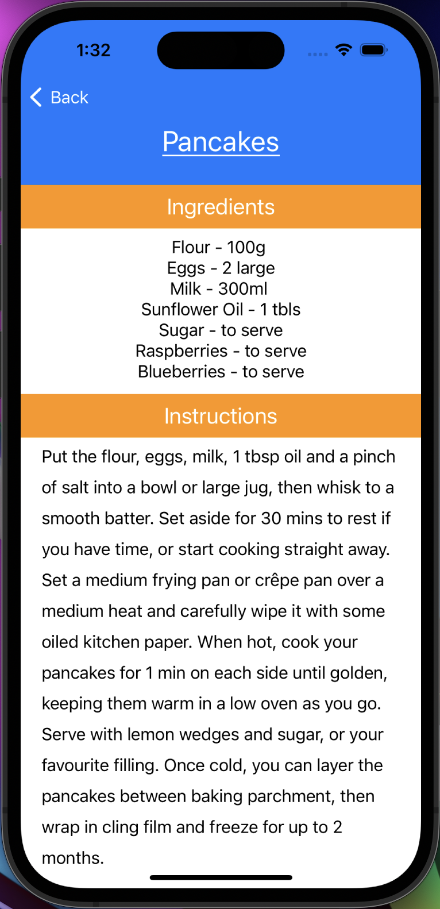

# myRecipes App

- Created by David Kipnis on 4/28/2023

## Overview

Project requirements:

- iOS 16.4+
- Xcode 14.3
- TheMealDB API (https://www.themealdb.com/api.php)

### Summary: 

An iOS application developed in Xcode using SwiftUI. Fetches data using Swift's URLSession class from TheMealDB's API. Current functionality includes fetching from the API's Dessert category and looking up individual recipe details by recipe ID. 

Sample app snapshots are included [here](https://github.com/thedavidkipnis/myRecipes/tree/main/Documentation.docc/Resources).

### Issue Tracking:

https://github.com/thedavidkipnis/myRecipes/issues

## Installation and launch instructions

Project URL: https://github.com/thedavidkipnis/myRecipes.git

Please ensure that you have Xcode 14.3 downloaded and installed.

Using Bash:

1) Open a terminal window
2) Run the following command: git clone https://github.com/thedavidkipnis/myRecipes.git
3) Once the repository has finished cloning, navigate to where you cloned the repository to in Finder.
4) Navigate into the 'myRecipes' folder, and open 'myRecipe.xcodeproj'
5) Once Xcode has opened the project, hit the 'Run' button in the top left corner of the screen.

Using Xcode:

1) Open Xcode. In the menu, select the option to 'Clone an existing project.'
2) In the pop up menu, paste the Project URL into the field and tap 'Open'
3) Once Xcode has opened the project, hit the 'Run' button in the top left corner of the screen. 

Note: by default, Xcode launches projects in its simulator. If you want to test the app on your physcial device, do the following before executing steps 5 and 3, respectively, from above:

1) Connect your mobile device to yoour machine.
2) Ensure that the iOS on your device matches the minimum requirement.
3) In the top middle of the Xcode screen, tap the device icon to the left of 'myRecipe.'
4) Select your device from the drop down menu.

## Project Specifics

### Structure:

- ContentView.swift: Main entry point for app. Includes all recipe icons fetched from API. Communicates with DetailedView. Has a cache for stashing loaded recipes for quicker lookup to avoid too many calls to the API.
- DataFetch.swift: Contains all functionality for communicating with API and processing received data. Sends processed data to ContentView.
- Recipe.swift: contains all view structs for how recipes get displayed on app's pages. 

### Future Improvements:

- Adding images to icons on the main page and at the top of the detailed pages for a better user experience.
- Add a search bar for looking up dessert by name to filter through large list of recipes.
- Add a proper loading screen to main page while recipes are being fetched and processed.
- Fixing instruction displays so that they are easier to read by separating paragraphs. 
- All functionality fixes that are included on the repository's [issue tracker](https://github.com/thedavidkipnis/myRecipes/issues).
