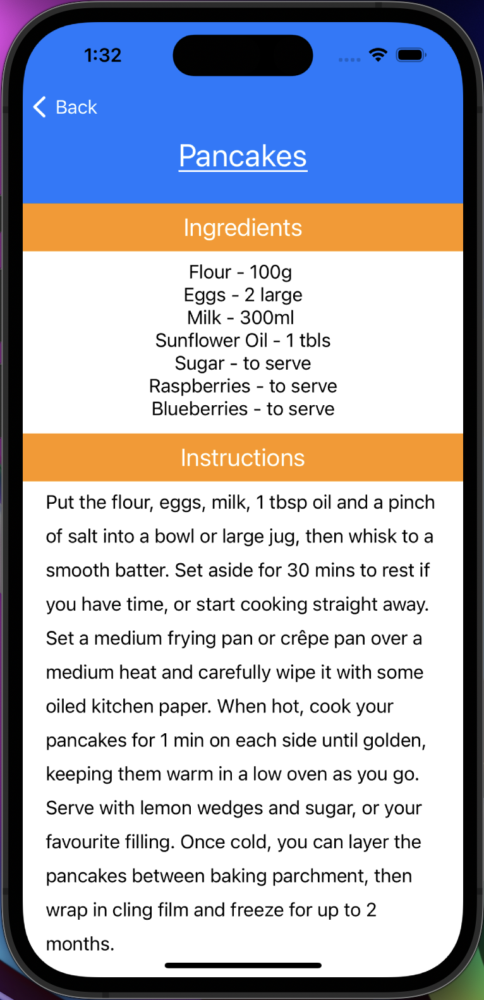

# myRecipes

Recipe app I developed as an exercise for Fetch!

Fetches and displays recipes from TheMealDB's Dessert category, giving users the option to choose a recipe and view its details such as instructions and ingredients. 

 

## Installation:

All installation instructions and documentation are included [here](https://github.com/thedavidkipnis/myRecipes/blob/main/Documentation.docc/Documentation.md).
